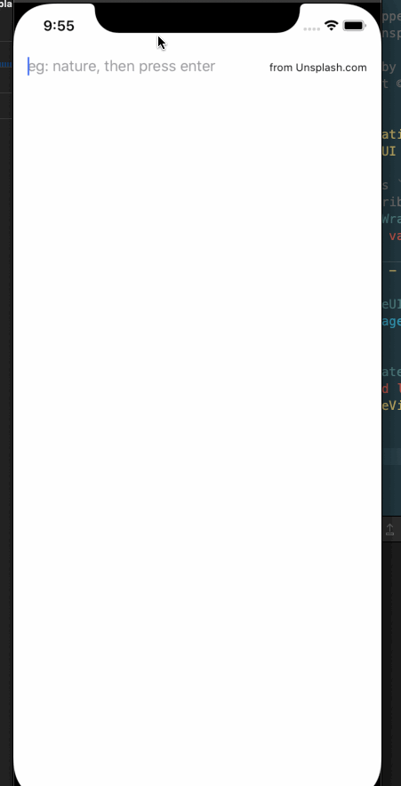

# CombineUnsplash

A sample project exploring SwiftUI/Combine and Result, using Unsplash API via Picsum.photos

As SwiftUI is a new paradigm shift since the introduction of Swift, and it's relative new, so we as [community](https://github.com/Juanpe/About-SwiftUI) are learning and exploring how to use it day by day.

Here, I combine (no pun intended) SwiftUI and Combine for view and model binding by using [Picsum.photos](https://picsum.photos). I also use Result for network completion handler.

In every steps, I try to write comment on how and why to do it. 

I hope this sample is useful to both me and everyone for reference.

### Demo

### Why SwiftUI/Combine?

SwiftUI + Combine = 🤯 

translate: unidirection data flow is now possible in Swift, without having to use Rx or 3rd party libaries.

### Resources SwiftUI/Combine

+ https://developer.apple.com/tutorials/swiftui
+ https://developer.apple.com/documentation/combine
+ https://github.com/topics/swiftui
+ https://github.com/Juanpe/About-SwiftUI
+ https://github.com/vinhnx/notes/issues/270 (my own learning note about SwiftUI/Combine)

### Thanks for checking out!

:rocket:
