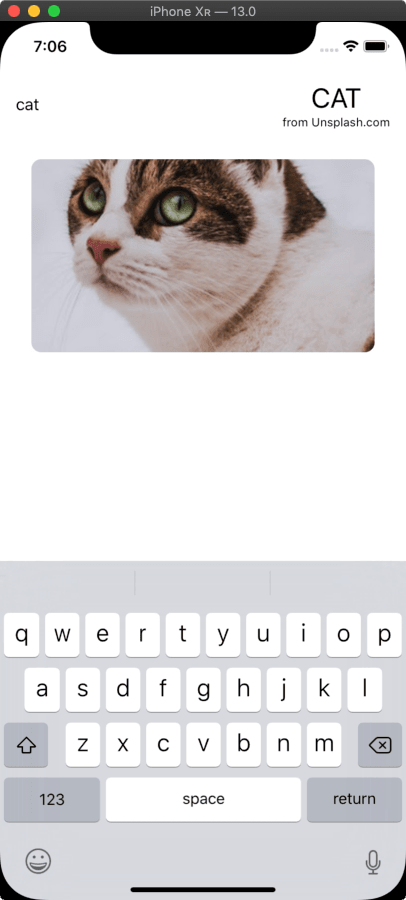

# CombineUnsplash

A sample project exploring Unsplash API, powered by SwiftUI + Combine + Result.

Also exploring how to [wrap UIKit component (UIImageView) to use binding](https://github.com/vinhnx/CombineUnsplash/blob/master/CombineUnsplash/View/ImageWrapper.swift).

## Unsplash API

+ https://picsum.photos
