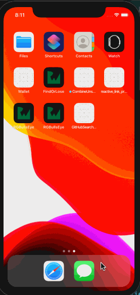

# CombineUnsplash

A sample project exploring MVVM pattern with [SwiftUI](https://developer.apple.com/xcode/swiftui/)/[Combine](https://developer.apple.com/documentation/combine), using [Unsplash](https://unsplash.com) API (via [Picsum.photos](https://picsum.photos) API) with detail example.

### Resources SwiftUI/Combine

+ https://developer.apple.com/tutorials/swiftui
+ https://developer.apple.com/documentation/combine
+ https://github.com/onmyway133/blog/issues/487
+ https://twitter.com/luka_bernardi/status/1155944329363349504
+ https://www.vadimbulavin.com/asynchronous-programming-with-future-and-promise-in-swift-with-combine-framework/
+ https://github.com/topics/swiftui
+ https://github.com/Juanpe/About-SwiftUI
+ https://github.com/vinhnx/notes/issues/270 (my own learning note about SwiftUI/Combine)

Combine and SwiftUI seem overwhelming at first, but once you get used to it (via side project, small experiment) it would become easier by time. :rocket:

